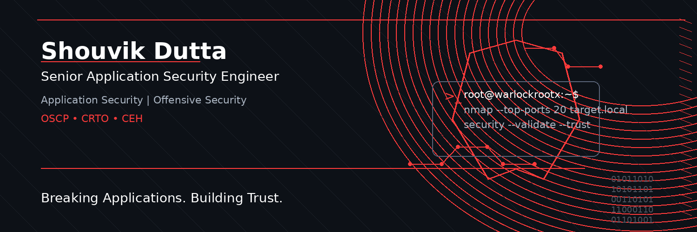

  

  

## 👨‍💻 About Me

I'm a **Senior Application Security Engineer** with **7+ years of experience** in Application Security and Offensive Security, helping organizations identify, assess, and remediate security risks across modern applications and infrastructure.

My expertise includes **Web Application Security, API Security, Mobile Security, Network Penetration Testing, Secure Code Review, Threat Modeling, and DevSecOps Security**. I enjoy solving complex security challenges, improving secure development practices, and helping organizations build resilient applications.

Outside of work, I actively pursue continuous learning, security research, and knowledge sharing while exploring emerging areas such as AI Security and modern application protection.

### 🚀 Quick Snapshot

- 🛡️ Senior Security Consultant
- 📍 Kolkata, India
- 🎯 Focus Areas: Application Security • Offensive Security • Network Security
- 🏆 Certifications: OSCP • CRTO • CEH
- 🌱 Currently Exploring: Secure AI Applications & Cloud Red Teaming
- 💬 Open to collaboration on security research and open-source projects

## Hi there 👋

<!--
**shouvikdutta1998/shouvikdutta1998** is a ✨ _special_ ✨ repository because its `README.md` (this file) appears on your GitHub profile.

Here are some ideas to get you started:

- 🔭 I’m currently working on ...
- 🌱 I’m currently learning ...
- 👯 I’m looking to collaborate on ...
- 🤔 I’m looking for help with ...
- 💬 Ask me about ...
- 📫 How to reach me: ...
- 😄 Pronouns: ...
- ⚡ Fun fact: ...
-->
